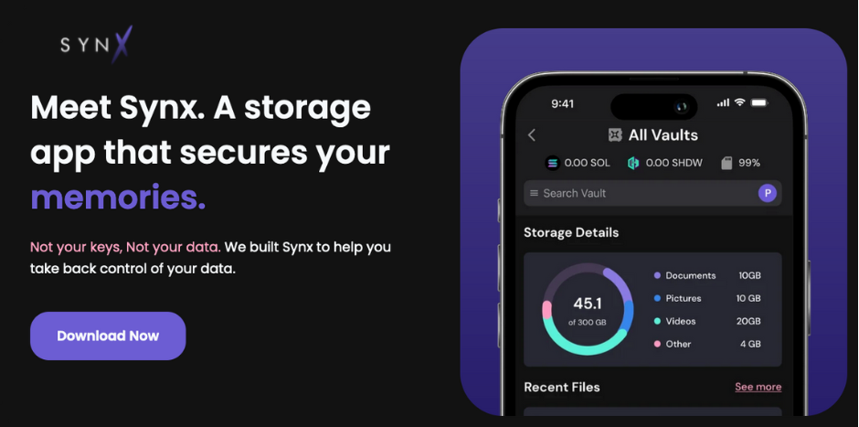
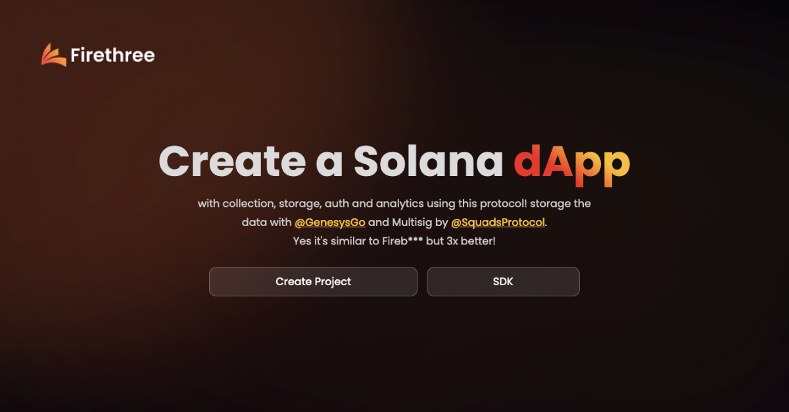
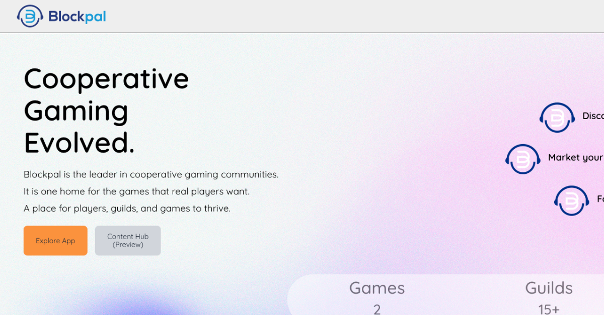

# Shdw Ecosystem

**Shadow Storage**

ShdwDriveと対話するための最も広く使われているGUIの1つです。ファイル管理、転送と共有、不変のストレージ、プライベートメモ、リアルタイムのコラボレーションなど、チームや個人が暗号と分散化を通してWeb3の力を解き放つことができるユニークなユーザーエクスペリエンスです。

**SYNX**

Blxckoutチームによって開発されたSynxは、実世界のモバイルおよびデスクトップデータを管理するための優れたUI/UXを提供します。また、包括的なドキュメントが付属しており、ユーザーフレンドリーな製品となっています。Synxは、ShdwDriveを活用したモバイルおよびデスクトップ用アプリでサポートされるプライベートクラウドストレージソリューションです。

**SPLING**

オンチェーンソーシャルメディアプラットフォームの構築を支援するソーシャルプロトコルです。ブロックチェーンの予備知識は不要で、開発者に優しい。Web3ソーシャルアプリを簡単に構築し、ユーザーが喜ぶ新しい暗号体験の扉を開けましょう。

**Firethree**

Firebase for Web3.このプロトコルで、コレクション、ストレージ、アナリティクスを備えた独自のSolana dAppを作成しよう。ShdwDriveによるストレージとSquadsProtocolによるマルチシグ。

**Blockpal**

Blockpalは協力型ゲームコミュニティのリーダーです。本物のプレイヤーが求めるゲームのための1つのホームです。プレイヤー、ギルド、ゲームが繁栄する場所です。

#### **Blok.host Web Hosting**

ShdwDrive上に構築されたバックエンドストレージを持つ、シンプルで安全なWeb3ホスティングです。BlokHostは、ユーザーがウェブサイトを迅速に展開し、プラットフォームのノードネットワークを使用して、最適に効率的な方法でコンテンツをグローバルに配布することを可能にします。

[.png>)](https://blok.host/)

#### **Coach's Coin Clicker**

ShdwDriveの不変ストレージ上で不滅化された完全分散型オンチェーンゲームの例。Coin ClickerはShdwDriveの素晴らしいCDNパフォーマンスだけでなく、perma-dAppsを作成する能力を示しています。

#### **AlphaBatem's Shdw UI**

このツールは、SOLからSHDWへのスワップ処理など、ShdwDriveのストレージアカウントとのやり取りをスピーディーに行うためのものです。



#### **A Rust CLI for ShdwDrive**

コミュニティメンバーからの素晴らしい貢献がまた一つ増えました！ShdwDriveを操作するためのRustベースのCLIです！



#### **このリストに載っていない？** [**Submit a PR**](https://github.com/GenesysGo/docs-shadow-cloud) **または、私たちの** [**Discord**](https://discord.gg/genesysgo) **にご連絡ください。**。

\[1] 免責事項：私たちのウェブサイトに表示される「Shadow Ecosystem」プロジェクトは、独立した第三者機関によって開発・運営されていることをご承知おきください。GenesysGoは、これらのサードパーティプロジェクトが提供するいかなるコンテンツ、製品、サービスについても責任を負いません。エコシステム内のサードパーティプロジェクトの順序や配置は、いかなるランキング、優先順位、優劣を意味するものではありません。あなたが交流することを決めたサードパーティプロジェクトの品質、セキュリティ、合法性、および適合性を評価するのは、あくまでもあなたの責任です。
