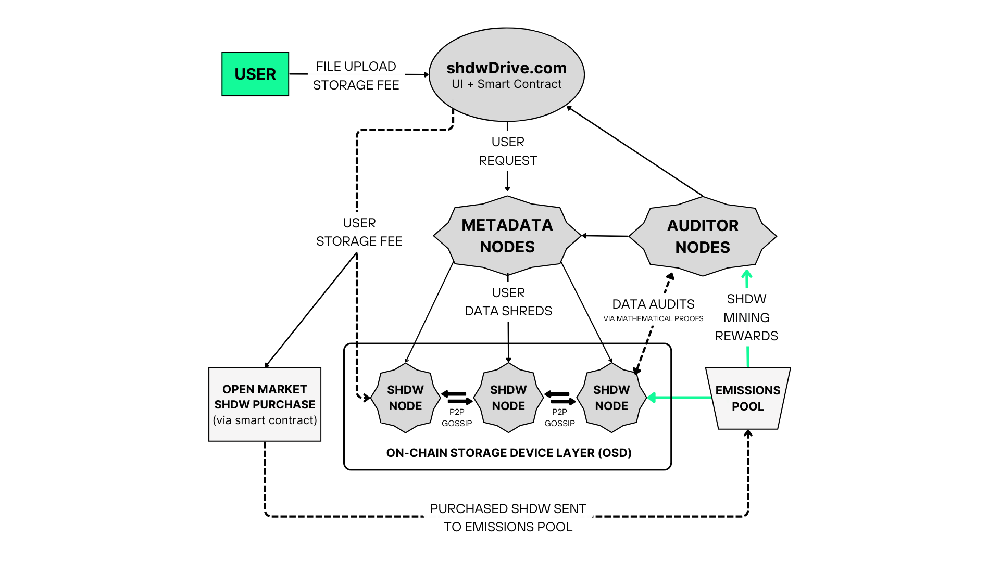

# ユーティリティ

SHDWのユーティリティに関する包括的な詳細については、[ここからスタート](https://www.shdwdrive.com/blog/unlocking-the-shdw-token)をご覧ください。以下の技術的な要約に加えて、この記事を読むことをお勧めします。



### SHDWトークンの価値を解き放つ

SHDWは、分散型データストレージインフラストラクチャの持続可能性とセキュリティのために設計されたユニークな暗号通貨です。ステーキング、ハーフビング、スラッシング、リサイクルといったネットワークの仕組みは、SHDWがネットワークを保護し、価値を高めるための効果的なツールとなるよう、慎重に設計されています。これらの仕組みは、報酬やインセンティブとともに、トークン保有者をネットワークの安全確保に貢献する積極的な参加者に変えるように設計されています。

<figure><figcaption>
ハイレベルネットワーク設計
</figcaption></figure>

### **ステーキングとネットワーク参加**

ステークとは、保有者がトークンを保有することで報酬を得る仕組みです。SHDWトークンを消費または取引する代わりにステークする保有者は、ネットワークに参加し、ネットワークの安全確保を支援することで報酬を得られます。ネットワークへの参加に対して保有者に報酬を与えるこのプロセスは、当社のエコシステムの中心であり、当社の全体的な設計プロセスの中核をなすものです。私たちは、ステーキングの仕組みがネットワークとホルダーの両方に同時に価値をもたらすと信じています。

shdwNodesのオペレーターはSHDWネットワークの基盤であり、円滑な運営を保証します。サーバーをshdwDriveネットワークに接続し、報酬を獲得するために、潜在的なshdwNodeはネットワーク内の場所を確保するためにSHDWをステークしなければなりません。この要件はコミットメント料のようなもので、真剣で熱心な参加者のみがネットワークを管理できるようにします。正確な金額はまだ決定されていませんが、shdwNodeオペレーターになることを軽々しく決めてはならないほど重要な金額であるべきだと考えています。オペレーターは、ステーキングという形で事実上保証金を預けることで、ネットワークの健全性と効率性へのコミットメントを示します。これにより、堅牢で信頼性の高いシステムが保証され、ネットワーク全体のパフォーマンス、ユーザーの真実の維持、ひいてはSHDWの価値の維持に不可欠なものとなります。

とはいえ、すべての人がshdwNodeオペレーターになることを望んでいるわけではありませんし、そのような人であっても個別にステーキングの要件を満たすことは難しいかもしれません。さらに、SHDWコミュニティのメンバーは、あらゆるレベルの技術的専門知識を持ち、有意義な方法でネットワークに貢献することを強く望んでいることが、フィードバックによって明らかになりました。そこで登場するのがシェアード・ステーキングです。

SHDWホルダーは、スマートコントラクトを通じてSHDWトークンをshdwNodeオペレーターに委任し、ノードが受け取る排出量を共有します。shdwNodeノードへの排出量スマートコントラクトからの報酬は、shdwNodeオペレーターと、そのshdwNodeノードオペレーターとステークしたSHDW保有者との間で分配されます。この成功の共有モデルは、コミュニティの強い絆を育み、両者にネットワークの成長に積極的に貢献するインセンティブを与えます。

**シェアードステーキング**

* ステーキング: ホルダーはネットワークを確保することで報酬を得られます。
* shdwNode Operators： サーバーをShdwDriveに接続するには、SHDWをステーキングする必要があります。
* 共有ステーキング： 共有ステーキング：SHDW保有者は、共有ステーキングプールを通じてshdwNode Operatorsにトークンを委任し、ノード排出を共有することができます。

**テストネット2のステーキングが開始されました！** [**参加する**](https://testnet.shdwdrive.com/)**そしてもっとSHDWを稼ごう!**

### **収益分配とトークノミクス**

私たちは、ShdwDriveネットワークのトークノミクスを長期的に可能な限り持続可能なものにすると同時に、ShdwDriveのユーザーベースが拡大し、収益が拡大するにつれてトークンに価値が発生するようにすることを約束します。

**分配と報酬**

SHDWのトークノミクスには収益分配モデルが組み込まれており、ストレージの顧客手数料の一部はShdwOperatorsに分配され、一部はオープンマーケットからのSHDWの買い戻しに使用されます。これらの買い戻しはトークンの流動性をサポートし、排出プールに追加され、持続可能なトークンエコノミーに貢献します。トークンの収益シェアと半減スケジュールは、ネットワーク全体のインセンティブを調整します。

* ストレージフィー： 60-75％をSHDWオペレーターに、残りをSHDWの買い戻しに充てます。
* 買い戻し： SHDWの需要を高め、流動性を高めます。
* 排出プール：買い戻されたSHDWは排出プールに追加され、トークンの速度が遅くなります。

**スラッシングメカニズム**

スラッシングは、SHDWネットワーク内の公平性とセキュリティを維持するための重要なメカニズムです。これはshdwNode Operatorに対するペナルティシステムで、ネットワーク内で役割を果たせないノードやネットワークに損害を与えようとする悪質な行為者からネットワークを保護します。

* スラッシング：ノードのパフォーマンスが低下したり、悪意のある行動をとったりした場合、shdwNodeオペレーターにペナルティが課せられます。
* ペナルティ：ステークされた SHDW の 5％を失います。ネットワークからの削除を避けるためには、SHDW を交換する必要があります。

**監査ノード**

監査ノードとして機能するサーバーとモバイルデバイスは、Proof of Workマイニングに似たコンセプトの数学的証明システムを通じて、ShdwDriveネットワークに保存されたデータの完全性を監査する重要なタスクに参加します。報酬は、shdwNode Operatorsによって提出された数学的証明を解き、その真実性と信頼性を証明することで得られます。

* 監査ノード： ネットワークデータの整合性を監査するサーバーまたはモバイルデバイス
* 報酬： 数学的証明を解くための排出
* スラッシング：不誠実に行動する監査ノードに適用されます

**スラッシュされたトークンのリサイクル**

ShdwDriveはこれらのトークンをSHDWエコシステムにリサイクルします。

* 削減されたSHDWトークンは排出プールに戻されます。
* 報酬の分配を拡大します。
* トークンの速度が低下します。
* 効率的な資源利用と持続可能性へのコミットメント。

**半減スケジュール**

半減という概念は、供給をコントロールし、ひいては価値を高める方法です。この希少性メカニズムにより、ネットワーク参加者はShdwDriveとD.A.G.G.E.R.の技術を早期に採用することができ、早期支持者にはより高い報酬が与えられるため、SHDWの価値が長期的に高まる可能性があります。これは、新たなネットワーク参加者を引きつけるための危機感を生み出す方向に働き、リソースとユーザー数の拡大によってネットワーク全体に利益をもたらします。

* 供給をコントロールし、価値を高めます
* 7,000,000SHDWが排出量として固定され、毎年支払われます
* 新たなトークンの参入を減らすため、2年ごとに半減します。

#### **エコシステムの成長と拡張性**

SHDWトークンは、ダイナミックで相互接続されたエコシステムをオーケストレーションする中心的存在です。参加へのインセンティブを与え、計算能力を確保し、ネットワークのスケーラビリティを促進します。ShdwDriveが成長するにつれ、SHDWの需要が高まり、トークンの価値提案が強化されます。トークンのデザインは、トークンの速度低下や積極的なネットワーク参加など、価値を高める行動を促し、堅牢でスケーラブルなインフラを育成します。

#### **コミュニティ主導のイノベーション**

共有ステーキングとコミュニティ・フィードバック・メカニズムを通じて、$SHDW保有者はネットワークの方向性と成功に貢献する権限を与えられます。この協力的なアプローチにより、ShdwDriveプラットフォームが拡大するにつれて、SHDWトークンに生じる価値も拡大し、エコシステムのすべてのステークホルダーに利益がもたらされます。

これらの仕組みがすべて組み合わさることで、ユニークで重要なダイナミズムが生まれ、SHDWDriveの収益成長とSHDWトークンの価値発生の間に明確で検証可能なリンクがあることが保証されます。これはまた、ShdwDriveプラットフォームに既得権益を持つすべての人が、プラットフォームのマーケティングとユーザーベースの拡大に貢献する動機付けにもなります。

最終的に、私たちの目標は、プラットフォームが成功するにつれて、SHDWトークンの価値も増加するようにすることです。このダイナミックな動きはこの目標を達成するだけでなく、SHDW保有者が技術的な知識を全く必要としない方法で、保有するトークンに直接影響を与える行動を起こす方法を提供します。

**フィードバックとコミュニティへの参加**

* コミュニティからのフィードバックは、https://github.com/GenesysGo/shdw-improvement-proposals/。

SHDW トークンは [Jupiter.](https://jup.ag/swap/USDC-SHDW) で購入できます。
